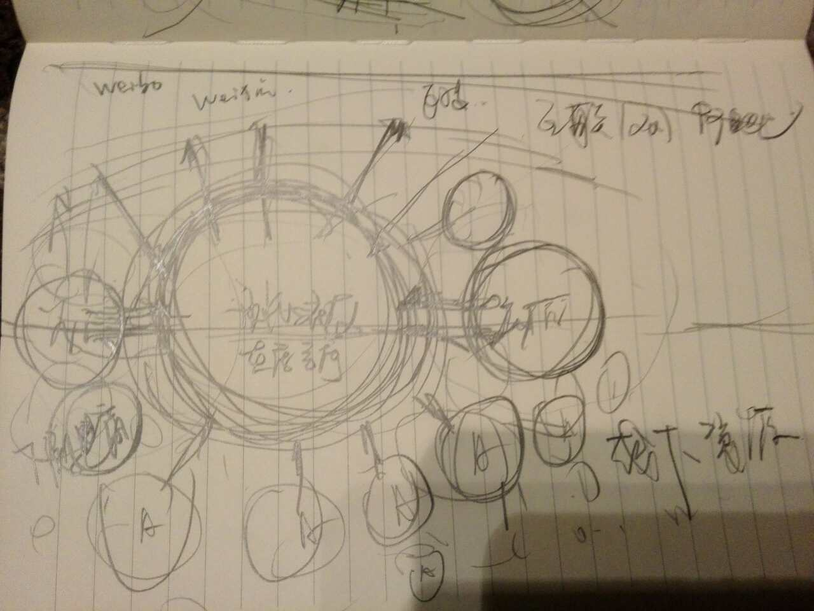
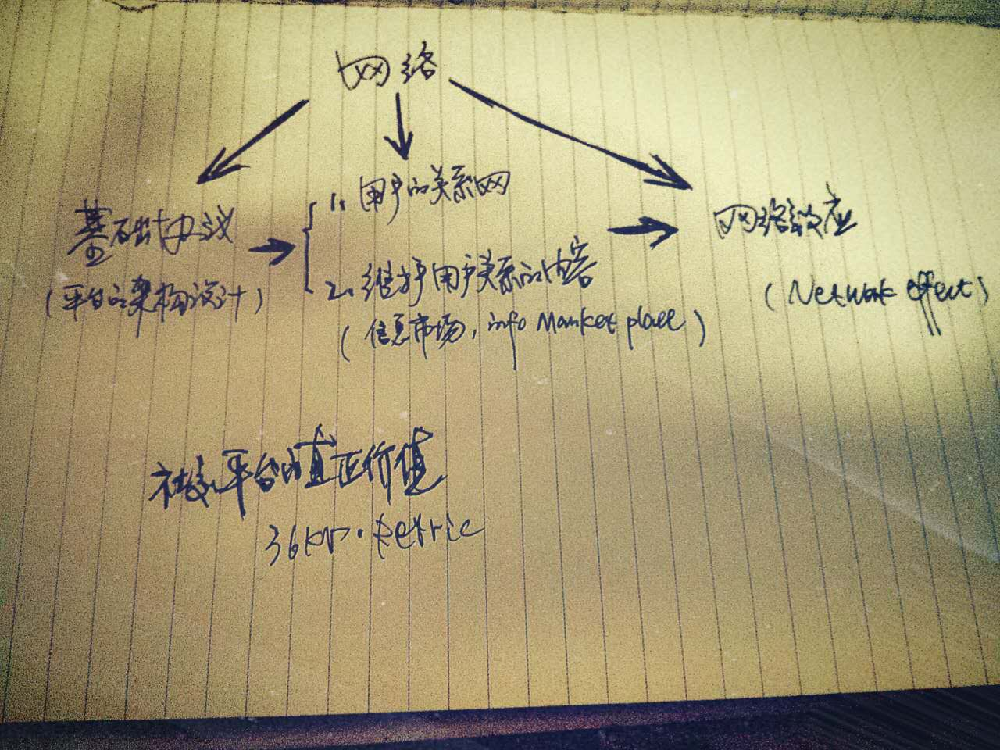

# 社区

内核组成：

1. 设计师及项目数据库    
1. 网络推广（搜索引擎、社交网络、兴趣图谱）工具即渠道  
1. 活动  
1. [问答](qa.md)
1. 专业APP

  
示意图: ikuku生态圈及市场拓展 copyright 马海东 

O2O社区建设（信息透明）+ O2O信用机制（第三方担保） online  
 

# 社区建设  SOLOMO

  
示意图: 社交平台的真正价值 copyright 36kr 

**1. 设计师及项目数据库**  

1. people
1. picture
1. post
1. album

 
   
**2. 网络推广（搜索引擎、社交网络、兴趣图谱）工具即渠道**    

1. comment
2. feed
3. faverite  

**3. 活动**

**4. 问答**  

1. 设计疑惑（行业问题）  
2. 如何使用线上社区（互联网问题）  
3. 其他  

**5. 专业APP** 
 

